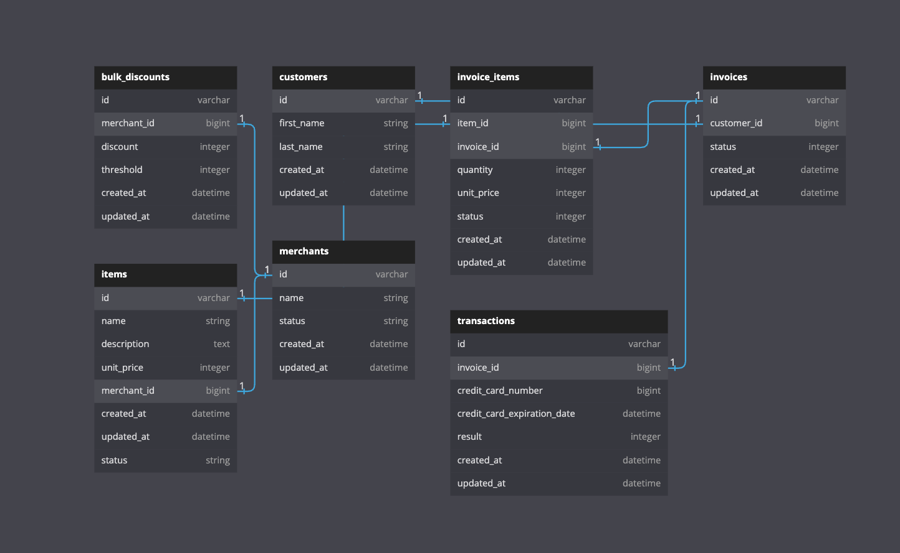

<p align="center">
  
</p>
<center><h1>Info</h1></center>
 This project was created to give users access to several different API endpoints relating to Merchants, Items, and items owned by a specific Merchant.

## About the Project
The API supports relationships between Merchants and Items, allowing you to grab a certain Items Merchant or a Merchants Items. The full rundown of API endpoints will be located below in endpoints

## Built With


## Gems


## Set Up
- Clone this repo
- `bundle install`
- `rails s`

## Database Creation
- `rails db:{create,migrate,seed}`
- `rails db:schema:dump`

## Database Structure



## Testing Instructions

- Clone this repo
- in terminal (apple or integrated)
    * bundle install
    * bundle exec rspec

## End Points

#### Add item to fridge

```
get https://waste-no-more-fe.herokuapp.com/api/v1/items/create
```

```
{
  "data": {
        "id": "2511",
        "type": "item",
        "attributes" : {
          "name": "apple",
          "expiration": "2112-12-21"
        }
  }
}
```

#### Add item to fridge

```
get https://waste-no-more-fe.herokuapp.com/api/v1/items/delete
```

```
{
  "data": {
        "id": "2511",
        "type": "item",
        "attributes" : {
          "name": "apple",
          "expiration": "2012-12-21"
        }
  }
}
```

#### Show a User

```
get https://waste-no-more-fe.herokuapp.com/api/v1/users/show
```

```
{
  "data": {
      "id": "2112",
      "type": "user",
      "attributes" : {
        "name": "Geddy",
        "email": "rocinante@cygnus.com"
      }
    }
}
```

#### Create a User

```
get https://waste-no-more-fe.herokuapp.com/api/v1/users/create
```

```
{
  "data": {
      "id": "2112",
      "type": "user",
      "attributes" : {
        "name": "Geddy",
        "email": "rocinante@cygnus.com"
      }
    }
}
```

#### Get User's Items
``` get https://waste-no-more-be.herokuapp.com/api/v1/users/item ```

```
{:data=>
  [{:id=>"49",
    :type=>"item",
    :attributes=>{:id=>49, :name=>"honey dew", :expiration=>"2022-08-04", :days_til_expiration=>nil}},
   {:id=>"44",
    :type=>"item",
    :attributes=>{:id=>44, :name=>"milk", :expiration=>"2022-08-10", :days_til_expiration=>nil}}]}
```


#### Get User's Groceries
```get https://waste-no-more-be.herokuapp.com/api/v1/groceries```

```
{:data=>
  [{:id=>"18", :type=>"grocery", :attributes=>{:id=>18, :name=>"bananas"}},
   {:id=>"19", :type=>"grocery", :attributes=>{:id=>19, :name=>"cold brew"}}]}
```


#### Create Grocery
```get https://waste-no-more-be.herokuapp.com/api/v1/groceries```

```
{:data=>
  [{:id=>"18", :type=>"grocery", :attributes=>{:id=>18, :name=>"bananas"}},
   {:id=>"19", :type=>"grocery", :attributes=>{:id=>19, :name=>"cold brew"}}]}
```


## Contributions
<a href="https://github.com/Dominicod/rails-engine-lite/graphs/contributors">
  
</a>
<p>🔥 Github: <a href="https://github.com/Dominicod">https://github.com/Dominicod</a> LinkedIn: <a href="https://www.linkedin.com/in/dominic-odonnell/">https://www.linkedin.com/in/dominic-odonnell/</a>  </p>


